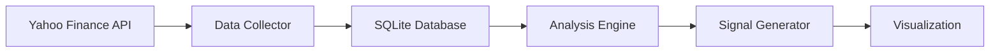
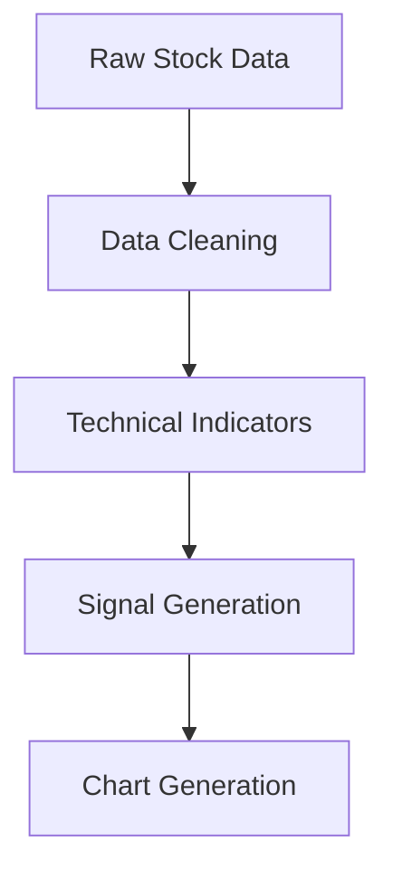

# SmartScan: Nifty 50 Technical Analysis Tool

## Introduction
SmartScan is a powerful Python-based technical analysis tool designed specifically for analyzing Nifty 50 stocks. This tutorial will guide you through using and understanding the tool's features.

## What is Technical Analysis?
Technical Analysis (TA) is a method of evaluating investments by analyzing statistical trends from trading activity, such as price movement and volume. Unlike fundamental analysis, which looks at a company's business performance, technical analysis focuses on patterns in market data.

## Features

### 1. Data Collection
- Automated fetching of Nifty 50 stock data using Yahoo Finance API
- Intelligent caching system with SQLite database
- Fallback mechanisms for different stock symbols (NSE/BSE)
- Automatic data freshness checks

### 2. Technical Analysis
The tool calculates a comprehensive set of technical indicators:

#### Price-based Indicators
- Simple Moving Averages (SMA 20, 50)
- Exponential Moving Averages (EMA 20, 50)
- Bollinger Bands (Upper, Middle, Lower bands)

#### Momentum Indicators
- Relative Strength Index (RSI)
- Stochastic Oscillator (K and D lines)
- True Strength Index (TSI)
- MACD (Moving Average Convergence Divergence)

#### Trend Indicators
- ADX (Average Directional Index)
- Vortex Indicator
- Support and Resistance Levels

#### Volume Indicators
- On Balance Volume (OBV)
- Chaikin Money Flow (CMF)
- Ease of Movement (EOM)
- Volume Moving Average

### 3. Signal Generation
SmartScan uses a multi-factor approach to generate trading signals:

- **Signal Types**: Strong Buy, Buy, Hold, Sell, Strong Sell
- **Factors Considered**:
  - Trend Strength (SMAs, EMAs)
  - Momentum (RSI, MACD)
  - Volume Confirmation
  - Support/Resistance Levels
  - Volatility (ATR)

### 4. Visualization
- Professional-grade technical analysis charts using mplfinance
- Customized layouts with multiple panels:
  - Candlestick charts with volume
  - RSI indicator panel
  - MACD indicator panel
  - Bollinger Bands overlay
  - Moving averages overlay

## Project Architecture

### Data Flow


### Analysis Pipeline


## Usage

### Command Line Interface
```bash
python -m src.cli.command_line --period 1y --min-strength 1.0 --save-report
```

Options:
- `--period`: Data fetch period (e.g., 1d, 1mo, 1y)
- `--min-strength`: Minimum signal strength to display
- `--save-report`: Save analysis report to file

### Example Output
```
SmartScan - NSE Market Scanner (2024-01-XX XX:XX:XX)
============================================================

Strong Buy Signals (X stocks):
============================================================
Stock Analysis: SYMBOL
Signal: Strong Buy
Current Price: ₹XXX.XX (+X.XX%)

Key Indicators:
RSI: XX.XX
MACD: X.XXX
Signal Strength: X.XX

Moving Averages:
SMA20: ₹XXX.XX
SMA50: ₹XXX.XX

Volume Analysis:
Volume Trend: High/Normal/Low (Ratio: X.XX)
```

## Project Structure
```
smartscan/
├── src/
│   ├── analysis/           # Technical analysis logic
│   ├── data_collection/    # Data fetching and caching
│   ├── visualization/      # Chart generation
│   ├── cli/               # Command line interface
│   └── output/            # Report generation
├── docs/                  # Documentation
└── data/                 # SQLite database
```

## Dependencies
- Python 3.x
- pandas: Data manipulation
- yfinance: Stock data fetching
- ta: Technical analysis indicators
- mplfinance: Chart generation
- SQLite: Data caching

## Best Practices
1. **Data Management**
   - Always check data freshness before analysis
   - Use cached data when available
   - Handle missing data gracefully

2. **Technical Analysis**
   - Combine multiple indicators for signals
   - Consider volume confirmation
   - Account for market volatility

3. **Risk Management**
   - Never rely on a single indicator
   - Always verify signals across timeframes
   - Consider market conditions and volatility

## Resources for Learning
1. **Technical Analysis**
   - [Investopedia Technical Analysis](https://www.investopedia.com/technical-analysis-4689657)
   - [TradingView Education](https://www.tradingview.com/education/)

2. **Python for Finance**
   - [Python for Finance Book](https://www.oreilly.com/library/view/python-for-finance/9781492024323/)
   - [QuantStart Articles](https://www.quantstart.com/articles/)

3. **Indian Stock Market**
   - [NSE India](https://www.nseindia.com/)
   - [Trading Hours and Holidays](https://www.nseindia.com/trade/trading-holidays)

## Contributing
Feel free to contribute to this project by:
1. Reporting bugs
2. Suggesting new features
3. Adding new technical indicators
4. Improving documentation

## License
This project is open-source and available under the MIT License.
